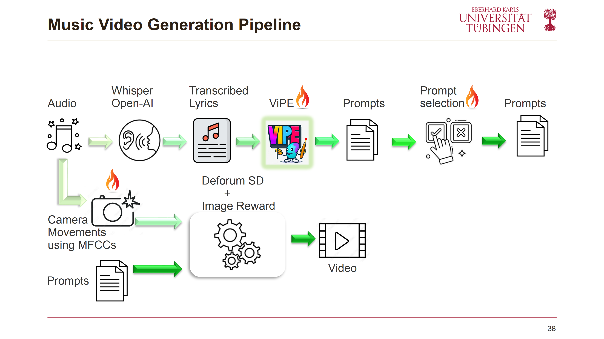
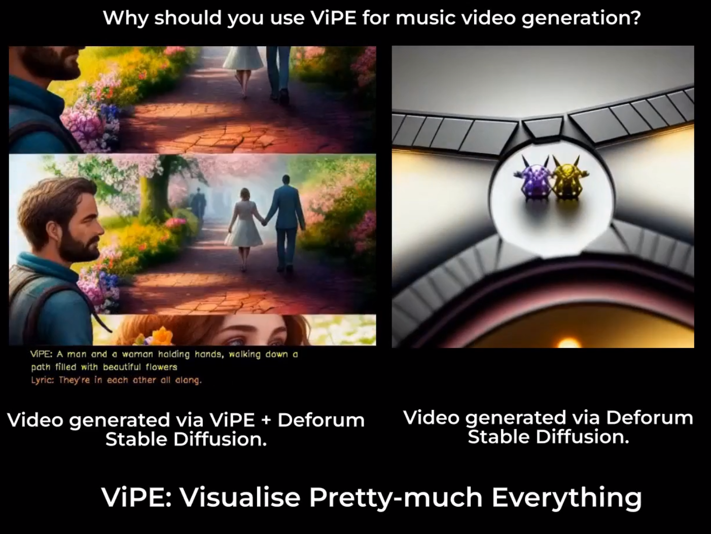

<div>
<h2 align="center"> ViPE Music Video Generation </h2>
<div>

<div align="center">
    
<div style="text-align:center">

</div>

### [ViPE Paper](https://arxiv.org/abs/2310.10543) | [ViPE Project](https://github.com/Hazel1994/ViPE) | [Prompt Generation Demo](https://huggingface.co/spaces/fittar/ViPE)


</div>

<h2 align="center">ViPE elegantly conveys the essence of abstract lyrics through visually meaningful representations.</h2>


<p align="center">
  <a href="https://youtu.be/qEI3fNXdTnY">
    
  </a>
</p>

## How to generate your own music video
- [How does it work](#How-does-it-work)
- [Installation](#installation)
- [Usage](#usage)

## How-does-it-work
- Transcribe the MP3 using Whisper by OpenAI.
- Provide the lyrics to ViPE for analysis.
- ViPE generates visual prompts for the lyrics.
- Select the most concrete and fitting prompt for each lyric line.
- Automatically calculate camera movements based on audio.
- prompts and camera movements are fed into Deform Stable Diffusion.
- Use ImageReward to choose an appealing image from Deform Stable Diffusion.
- Align the chosen image with the audio.
- Optionally, add lyrics and ViPE prompts to the video's bottom
## Installation
Clone the repository

```commandline
git clone git@github.com:Hazel1994/ViPE-Videos.git
cd ViPE-Videos
```
Create a virtual environment and Install the requirements
```commandline
virtualenv env
source env/bin/activate
pip isntall --upgrade pip
pip install -r requirements.txt 
```

## Usage
You only need to share an mp3 version of your song or story and place it in the 'mp3' folder.
There are plenty of exciting hyperparameters you can experiment with.
Here are a couple of fun examples to get you started:

### Generating a music video could be as simple as

Assume we have a story about a cute little rabbit ('story.mp3') and I want to save the music video in './rabbit_story/' firectory.
You can simply proceed with:
```python
python generate_video.py --mp3_file story --saving_dir ./rabbit_story/
```
Once the transcription is generated, the system will ask you to check
if the timestamps in the 'story_transcription' are correct.
```
Please check the timestamps of the generated transcription and the ViPE prompts.
Enter 'yes' to continue if youre happy with the transcription, or 'no' to stop and manually correct the file.:
```
The 'story_transcription' file is located in the mp3 folder with the following format:

```python
[
      {
            "start": 0.0,
            "end": 4.0,
            "text": " Long ago, in a forest lived a tiny rabbit."
      },
      {
            "start": 4.0,
            "end": 7.0,
            "text": " One day, when the rabit was resting on a rock,"
      },
      {
            "start": 7.0,
            "end": 10.0,
            "text": " it saw a dark-haired girl."
      }
]
```

Where each line of the lyrics is aligned with a time interval.
Listen to your audio and check if the timestamps (in seconds) are correct. 
if youre already happy with the lyrics and the
timestamps, then type yes. Otherwise, type no to stop the program and manually correct transcription file.

**Important Note** 
- Most of the time, there is room for improvements. So we encourage you to check this file.
- The timing does not have to be super accurate
- The end of the last line will be set based on the duration of your audio file

The program then proceed to generate prompts using ViPE. These files end with 'lyric2prompt'. In our example,
its 'story_ctx_1_sample_True_vipe_True_abst_0.7_lyric2prompt'.

**Optional**

You can check the quality of the generated prompts by simply opening the file:

```python
[
      {
            "start": 0.0,
            "end": 4.0,
            "text": " Long ago, in a forest lived a tiny rabbit.",
            "prompt": " A tiny rabbit hopfast in a colorful garden of flowers"
      },
      {
            "start": 4.0,
            "end": 7.0,
            "text": " One day, when the rabit was resting on a rock,",
            "prompt": " A tiny rabbit falls asleep on a rocky mountain, under the shade of a tall oak tree"
      },
      {
            "start": 7.0,
            "end": 11.088,
            "text": " it saw a dark-haired girl.",
            "prompt": " A creature with glowing eyes rests on a rocky mountain top, watching a girl with dark hair lying in a clearing"
      }
]
```

Here for example, 'it saw a dark-haired girl.' will be shown as 'A creature with glowing eyes rests on a rocky mountain top, watching a girl with dark hair lying in a clearing'
. If youre not happy with the generated prompt, you can simply update the file and run the program again.

The program will generate the video in your given directory based on the lyric2prompt file.

## Generating Higher Quality Videos

There are many hyperparamters you could try:

```
--vipe_checkpoint VIPE_CHECKPOINT
                        which version of vipe to fetch from huggingface?
  --mp3_file MP3_FILE   
                        name of the mp3 file
  --saving_dir SAVING_DIR
                        where to store the video and the required models
  --music_gap_prompt MUSIC_GAP_PROMPT
                        a prompt for nonvocal portions of the song/story
  --music_gap_threshold MUSIC_GAP_THRESHOLD
                        nonvocal interval in seconds for music_gap_prompt to be valid
  --prefix PREFIX       
                        the overall theme of the song/story, be careful, it might has a strong effect on the video
  --context_size CONTEXT_SIZE
                        how many sentences to look back while interpreting the lyrics
  --abstractness ABSTRACTNESS
                        a real number between 0 and 1, how abstract the song/story is?
  --skip_vipe           
                        pass the flag to skip using ViPE for prompt generation
  --image_quality_number IMAGE_QUALITY_NUMBER
                        how many images to generate for each frame, the best image will be selected
  --visual_effect_period VISUAL_EFFECT_PERIOD
                        how many seconds each effect (a combination of camera movements) should last, not valid for disco mode)
  --caption_mode CAPTION_MODE
                        set to lyrics to add the lyrics, set to both for lyrics + vipe prompts
  --skip_visual_effect  
                        pass the flag to skip camera movements
  --animation_mode ANIMATION_MODE
                        set to 2D for 2D animation
  --disco_mode          
                        pass the flag for disco mode

```

Here we will list a couple of tips that help you generate better videos most of the time.
- --context_size: if youre only visualizing a lsit of quotes or a set of independent lines, set it to 0. otherwise to 1 (the default value).
- --image_quality_number: If you could afford more memory, higher values than 1 always deliver better quality videos. 3 to 5 is what we recommend.
- --prefix: if the video does not really match the song at all, try setting it to broad theme that matches the song. For example 'love' for a love song.
or 'scholar' for a graduation song.

## Citation
if you find our project useful please cite our paper
```
@inproceedings{shahmohammadi2023vipe,
    title = "ViPE: Visualise Pretty-much Everything",
    author = "Hassan Shahmohammadi and Adhiraj Ghosh and Hendrik P. A. Lensch",
    booktitle = "Proceedings of the 2023 Conference on Empirical Methods in Natural Language Processing",
    month = dec,
    year = "2023",
    address = "Singapore",
    publisher = "Association for Computational Linguistics",
    url = "https://arxiv.org/abs/2310.10543",
    eprint={2310.10543},
    archivePrefix={arXiv},
    primaryClass={cs.CL}
    doi = "",
    pages = ""
}

```
## Acknowledgements
We would like to thank the following teams to make automated video generation possible
- [Deforum-stable-diffusion](https://github.com/deforum-art/deforum-stable-diffusion)
- [Whisper-OpenAI](https://github.com/openai/whisper)
- [Image-reward](https://github.com/THUDM/ImageReward)


